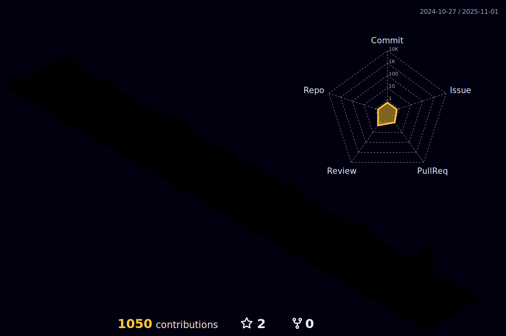

## Olá Mundo!
### Me chamo Gabriel Rodrigues, seja bem-vindo ao meu perfil, informações de Contato a disposição abaixo, sinta-se a vontade!

 

  

   

  

  

 |  |  |
 | ----------- | ----------- |

  <a href="https://github.com/gabrielucido">
  
  

 

  
  
  

  <small>Disclaimer: Desde 2019, devido ao trabalho, Gitlab tem sido a maior parte dos repositórios então tem muita contribuição no lado negro da força!</small>

